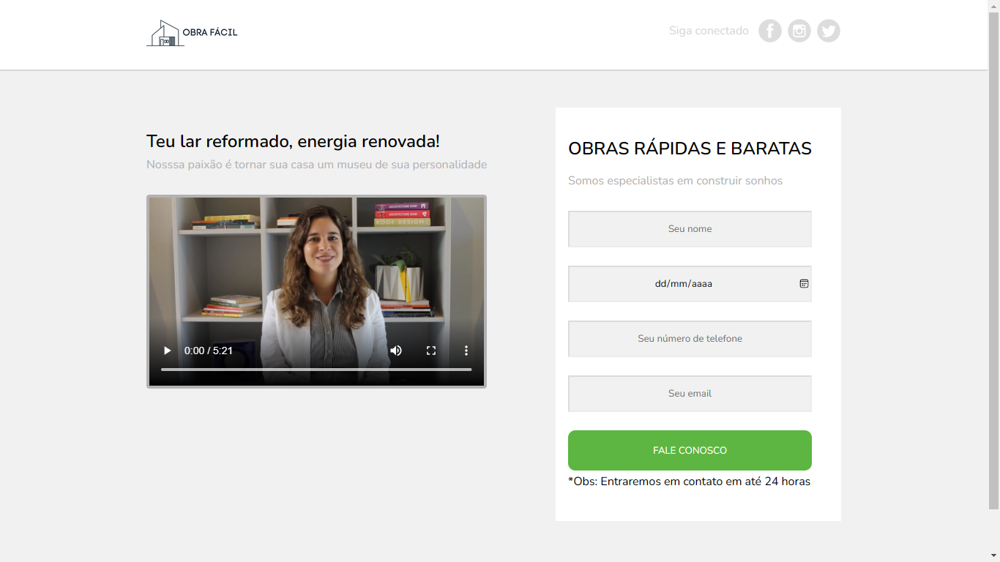

 

<h1>LandingPage 🍃</h1>

Imagem da LandingPage:

 

<h1>Mais sobre o projeto 🍃</h1>

Este projeto foi feito em 3 dias no total, como já disse isso foi feito para eu exercitar e aprimorar minhas habilidades de HTML e CSS

Para iniciar este projeto, eu peguei uma imagem do projeto final que meu prof. Thomas queria e fui fazendo tentando deixar parecido ao máximo com o projeto pedido.

